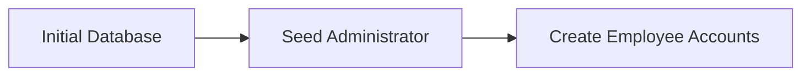
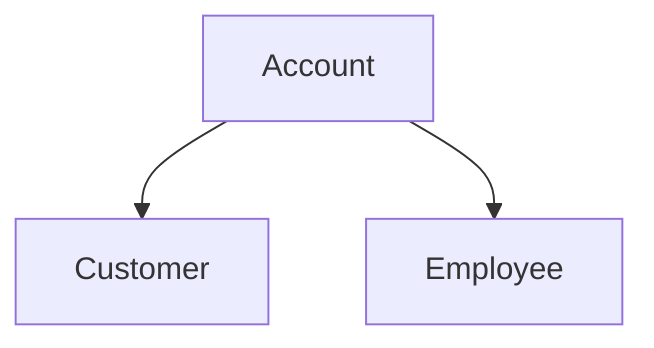
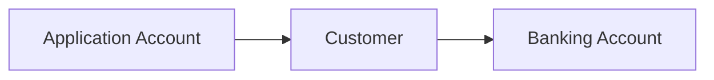
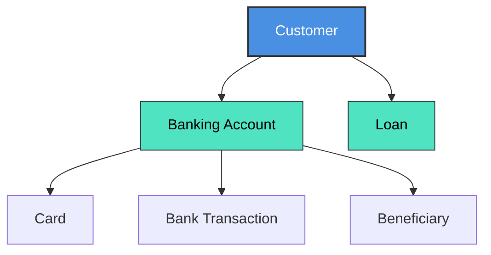
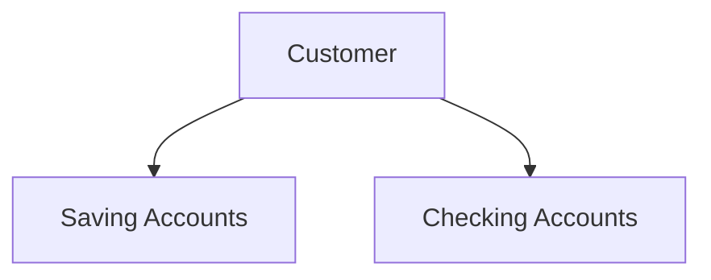
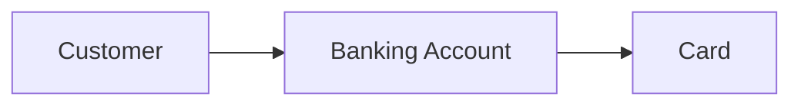
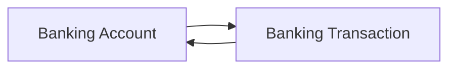
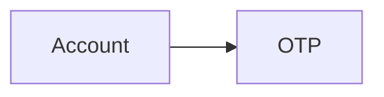
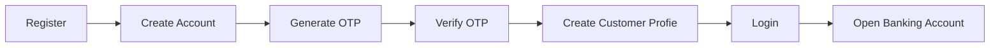

## Database Schema Design

#### Overview
The Banking System database is designed following the principles of database normalization (up to Third Normal Form - 3NF), ensuring that each table represents a single bussiness entity while minimizing duplicated data

The schema separates authencation data from banking data, making the system easier to maintain, extend and secure

The database consists of two categories:
* **Business Tables** - Store application data
* **Lookup Tables** - Store predefined values such as statuses, role and types

#### Design Goals
The database is designed with the following objectives:
* Separate authentication from business information.
* Minimize duplicated data.
* Maintain referential integrity through foreign keys.
* Support multiple banking accounts for a single customer.
* Provide a scalable architecture for future expansion.
* Follow common banking system design practices.

#### Authentication Architecture
Authentication is centralized in the Account table.

Every user who can access the system must own exactly one account.

The system supports three roles:
* Customer
* Employee
* Administrator

However, only Customer accounts can be registered through the application.

Employee accounts are created by administrators, while the initial administrator account is seeded during database initialization.

Customer registration follows a different workflow

This design prevents unauthorized users creating employee or administrator accounts

#### Separation of Authentication and Business Data
Authentication data is stored only in the Account table.

Business information is stored in separate tables.

This separation provides several advantages:
* A single authentication mechanism for every user.
* Passwords are stored in only one location.
* Customer and Employee share the same login architecture.
* Future user types can be added without redesigning the authentication system.

#### Separation of User Account and Banking Account
One of the most important design decisions is separating the application account from the banking account.

The Account table represents an application login.

The BankingAccount table represents an actual financial account.

A customer may own multiple banking accounts, each serving a different financial purpose.

Examples include:
* Savings Account
* Checking Account
* Business Account

This separation closely reflects real banking systems and avoids confusion between login credentials and financial accounts.

### Business Entities
Each business entity is isolated into its own table

**Tables** | **Responsibility** |
|---------|--------------------|
Account | Authencation and authorization
Customer | Customer personal information
Employee | Employee information
Branch | Bank branch information
BankingAccount | Customer financial accounts
Cards | Debit and credits cards
BankingTransaction | Financial transactions
Beneficiary | Saved transfer recipients
Loan | Customer loan records
OTP | One-time password verification
Notification | System notifications

Each table stores only data directly related to its own resposibility

### Customer Architecture
A customer represents a person using banking services.

Customer information contains personal data only.

Authentication is managed separately by the Account table.

A customer may own:
* Multiple banking accounts
* Multiple cards
* Multiple beneficiaries
* Multiple loans

### Employee Architecture
Employees are internal system users.

Unlike customers, employees cannot register themselves.

Employee accounts are created only by administrators.

Employees belong to a bank branch and are responsible for administrative banking operations.

This approach improves sercurity by ensuring that employee access is centrally managed

### Banking Account Architecture
The BankingAccount table stores financial account information.

Each banking account belongs to exactly one customer.

A customer may own multiple banking accounts.

Each banking account maintains:
* Account Number
* Current Balance
* Account Status
* Account Type
* Opening Date

Cards and transactions are associated with the banking account rather than directly with the customer.

### Card Management
Cards are linked directly to BankingAccount

This avoid duplicated customer references because ownership can already be determined through the banking account

Each banking account may own multiples card if required by future system expansion

### Transaction Architecture
Financial transactions occur between banking accounts

Each transaction records:
* Sender Account
* Receive Account
* Amount
* Transaction Type
* Transaction Status
* Timestamp
* Description

Completed transactions should remain immutable to preserve financial integrity and auditing requirements

### Beneficiary Management
Beneficiaries allow customers to save frequently used transfer recipients
This improves the transfer experience by reducing repetitive data entry
Each beneficiary belongs to a sigle customer

### Loan Management
Loan information is separated from banking account

Each loan belongs to one customer

Loan records maintain information such as:
* Loan Type 
* Principal Amount
* Interest Rate
* Remaining Balance
* Loan Status

This separation allows customers to own multiple independent loans

### OTP Management
OTP records are associated with Account instead of Customer

This allows OTP verification for multiple scenarios:
* Registeration
* Login Verification
* Password Reset
* Transfer Confirmation
* Email Verification

The OTP module is therefore reusable across the entire system

### Notification Management
Notifications are generated for important application events

Examples include:
* Money received
* Money transferred
* Password changed
* Card blocked
* Loan approved

Notifications belong to an Account, allowing both customers and employees to receive system messages

### Lookup Tables
The database uses lookup tables instead of storing repeated text value

Lookup tables include:
* Role 
* Position
* AccountStatus
* BankingAccountStatus
* BankingAccountType
* CardStatus
* CardType
* TransactionStatus
* TransactionType
* LoanStatus
* LoanType
* OTP Purpose
* Currency

Using lookup tables provides several benefits:
* Consistent data
* Easier maintenance
* Better validation
* Strong referential integrity

### Registration Workflow
Customer registration follows the sequence below

Employee creation follows a different process

This separation ensures that only authorized administrators can grant employee access

### Data Integrity
The database enforces integrity through:
* Primary keys
* Foreign keys
* Unique Constraints
* Check Constraints
* Default Constraints

Every relationship is explicitly defined using foreign keys to prevent orphan records and maintain consistency

### Scalability
The schema is designed to support future expansion without major structural changes

Potential future enhancements include :
* Joint banking accounts
* Credit cards
* Investment accounts
* AI fraud detection
* Audit logging
* Reward point system
* Currency exchange
* Online bill payment
* External banking integration

Because authentication, customer information and banking operations are separated, new modules can be integrated with minimal impact on the existing schema

### Conclusion

This database schema follows a modular architecture where each table has a single responsibility and every business relationship is clearly defined.

The separation between authentication, customer management, employee management, and banking operations provides a secure, maintainable, and scalable foundation for the Banking System.

The overall design closely resembles the architecture commonly used in modern banking applications while remaining appropriate for educational projects and relational database management systems.